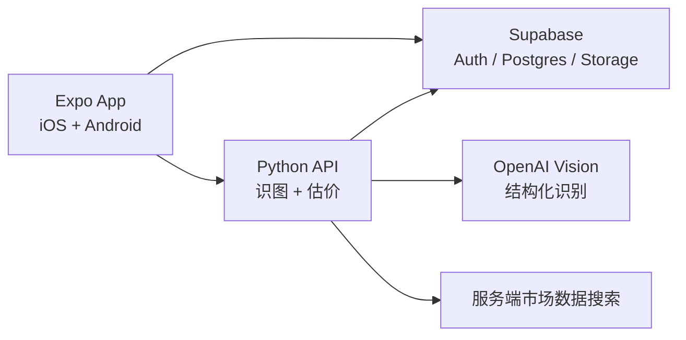

# Worth 实体资产管理 App 第一版设计

## 目标

为单个用户提供 iOS 和 Android 实体资产管理工具。用户拍摄一件物品后，由 AI 提取资产信息；用户确认并修改后保存。系统查询相似在售商品，生成当前参考市价，并在首页汇总总资产。

第一版完成以下闭环：

1. 拍摄一件物品的一张主图。
2. AI 识别名称、品牌型号、规格、分类和成色。
3. 用户确认或修改识别结果。
4. 保存资产并估价。
5. 在首页展示最新参考市价之和。
6. 用户可在资产详情手动刷新价格。
7. 同一账号的数据在 iOS 和 Android 间同步。

## 范围

### 包含

- 单用户登录。
- 一次拍摄并录入一件物品。
- AI 结构化识别和用户确认。
- 固定分类。
- 云端图片与资产同步。
- 录入时估价和手动刷新。
- 当前参考市价、价格区间、样本数和估价时间。
- 估价历史。
- 首页总资产和待估价数量。

### 不包含

- 注册、找回密码和用户管理。
- 多用户协作、家庭共享和权限管理。
- 多图识别、场景拆物和批量录入。
- 购买价、折旧、负债和收益计算。
- 出售、交易和社交功能。
- 定时或打开 App 时自动刷新价格。
- 向用户展示闲鱼、闲鱼登录态或估价数据源。

## 技术架构

### Expo App

负责相机、图片预览、识别确认表单、资产列表、资产详情、总资产和手动刷新。App 不保存服务端密钥或市场数据源登录态。

### Supabase

- Auth：只创建并使用一个用户账号。
- Postgres：保存资产和估价历史。
- Storage：保存私有资产图片。
- RLS：限制该账号只能访问自己的数据。

### Python API

提供两个职责明确的服务端接口：

- 图片识别：调用 OpenAI Vision，返回结构化资产字段。
- 市场估价：根据用户确认的数据构造查询，获取候选商品，筛除不相关和异常候选，返回参考市价。

Python API 复用参考任务 `019f8d69-c8ad-7750-8c4a-b012d3bb5f80` 已验证的商品搜索能力。数据源登录、Cookie 续期、失效检测和重连全部属于服务端运维职责，不出现在 App 页面或 API 文案中。

## 页面

### 首页

- 总资产参考价值。
- 已估价资产数量和待估价数量。
- 固定分类分布。
- 最近添加的资产。
- 拍照录入主入口。

总资产只汇总每件资产最近一次成功估价。没有可靠估价的资产不计入总额，并计入待估价数量。

### 拍照与确认

拍照后上传图片并请求 AI 识别。表单展示以下可编辑字段：

- 名称
- 品牌
- 型号
- 规格
- 分类
- 成色
- 估价搜索词

用户点击“保存并估价”后，先保存资产，再开始估价。AI 识别结果不得绕过用户确认直接入库。

### 资产详情

- 主图和资产信息。
- 最新参考市价、价格区间、样本数和更新时间。
- 手动刷新价格。
- 价格历史。

界面使用“参考市价”，不暗示或承诺实际成交价格。

### 账号入口

第一版只提供登录和退出登录，不提供注册、找回密码、账号管理或任何市场数据源设置。

## 固定分类

- 数码
- 家电
- 家具
- 服饰箱包
- 珠宝腕表
- 收藏
- 交通工具
- 其他

AI 必须从固定分类中选择一个，用户可以在确认页修改。

## 数据模型

### `assets`

| 字段 | 用途 |
| --- | --- |
| `id` | 资产 ID |
| `user_id` | Supabase 用户 ID |
| `photo_path` | 私有图片路径 |
| `name` | 资产名称 |
| `brand` | 品牌 |
| `model` | 型号 |
| `specs` | 结构化规格 |
| `category` | 固定分类 |
| `condition` | 成色描述 |
| `search_query` | 用户确认后的估价搜索词 |
| `latest_market_price` | 最近一次成功估价 |
| `latest_valuation_at` | 最近成功估价时间 |
| `created_at` | 创建时间 |
| `updated_at` | 更新时间 |

### `valuations`

| 字段 | 用途 |
| --- | --- |
| `id` | 估价记录 ID |
| `asset_id` | 对应资产 |
| `estimated_price` | 候选中位数 |
| `price_low` | 参考区间下界 |
| `price_high` | 参考区间上界 |
| `sample_count` | 参与计算的样本数 |
| `query` | 实际查询词 |
| `sample_summary` | 用于追查的候选摘要 |
| `created_at` | 估价时间 |

第一版不单独建立分类表或候选商品表。分类由固定枚举约束；候选摘要随估价记录保存。

## 数据流

### 新增资产

1. App 拍摄一张照片。
2. App 将照片上传至私有 Storage。
3. Python API 获取短期可访问的图片并调用 OpenAI Vision。
4. API 返回结构化识别结果和估价搜索词。
5. 用户修改并确认。
6. App 写入 `assets`。
7. Python API 使用确认后的字段搜索并筛选候选商品。
8. 有可靠样本时写入 `valuations`，并更新资产的最新价格和时间。
9. App 重新读取资产：首页总额随最新成功估价更新。

### 手动刷新

1. 用户在详情页点击“刷新价格”。
2. Python API 使用资产当前确认字段重新估价。
3. 成功时新增一条 `valuations`，并更新 `assets` 的最新价格。
4. 失败时保留此前成功价格，不写入伪造的历史记录。

## 估价规则

- 查询输入来自用户确认后的品牌、型号、规格、成色和搜索词，不直接使用宽泛的图片标签。
- 每次搜索前三页，并按商品 ID 去重。
- 先排除广告和无法解析、非正数的价格，再由 OpenAI 根据已确认的资产字段批量判断候选是否为同一产品；配件、其他型号和不同关键规格不参与计算。
- 至少有 5 个匹配样本才计算估价。
- 点估值使用候选价格中位数，避免极高或极低挂牌价过度影响结果。
- 价格区间使用匹配样本价格的第 25 和第 75 百分位，同时返回样本数和估价时间。
- 样本不足时不返回价格，资产保持或进入“待估价”状态。

## 错误处理

- 图片上传失败：停留在拍照流程并允许重试，不创建资产。
- AI 识别失败：保留当前图片，允许重试或手动填写。
- 资产保存失败：显示错误并允许重试，不启动估价。
- 估价失败：资产保存成功，显示“待估价”并允许手动重试。
- 刷新失败：保留最近成功价格，提示暂时无法更新。
- 服务端市场数据登录态失效：记录内部错误并告警；App 只收到通用的暂时无法估价响应。

## 安全

- OpenAI 密钥、Supabase 服务密钥和市场数据源登录态只存在服务端。
- App 使用 Supabase 用户会话，不持有服务角色密钥。
- 图片存储桶为私有，使用短期签名访问。
- `assets` 和 `valuations` 启用按 `user_id` 限制的 RLS。
- API 日志不得记录图片签名 URL、访问令牌或市场数据源 Cookie。

## 视觉方向

采用已确认的 UI 概念：暖白背景、深色文字、克制的深绿色强调色、圆角卡片和清晰的大字号资产数字。底部导航保持最小，只保留资产入口、中央拍照入口和账号/设置入口。

遵循 iOS 和 Android 的安全区域、相机权限和可访问性要求；文字和主要操作满足清晰对比度与足够触控面积。

## 验证

### 单元检查

- AI 响应结构校验和固定分类约束。
- 候选相关性过滤。
- 无效价格和异常候选排除。
- 中位数、价格区间和最低样本门槛。
- 总资产只汇总每项最新成功估价。

### API 检查

- 使用固定图片响应验证识别字段。
- 保存资产后触发估价。
- 估价成功、样本不足和服务端失败。
- 刷新失败不覆盖此前成功价格。

### App 流程检查

- 拍照、识别、修改、保存和估价完整流程。
- 识别失败后的重试和手动填写。
- 待估价资产展示。
- 手动刷新产生一条新历史记录。
- 同一账号在 iOS 和 Android 能看到相同资产、价格和总额。

## 完成标准

- 一张单物品照片可以形成一条可修改、可同步的资产记录。
- 可靠样本存在时展示参考市价、区间、样本数和时间。
- 没有可靠样本时明确显示待估价，不产生虚假金额。
- 首页总资产等于每件资产最近一次成功估价之和。
- 用户可手动刷新单件资产，并查看价格历史。
- App 中不出现闲鱼名称、登录状态、Cookie、连接入口或数据源设置。
